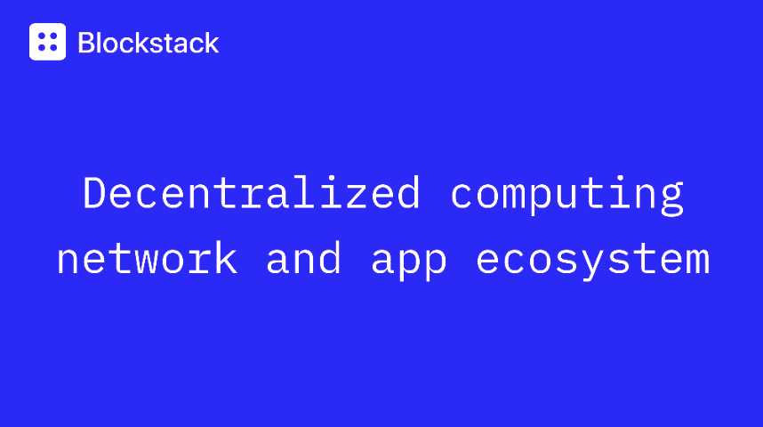

# Blockstack AMA

### ARCHIVE: August 28 - 1pm, #ama channel

---

Last week Blockstack spent some time with the Denver Dev's Slack Community to answer all of their questions!

Blockstack is a decentralized computing network and app ecosystem. They make it easy to create applications where users own their own identity and data. Blockstack is on a mission to foster an open, fairer Internet that protects privacy and freedom for all internet users. Commsor powered the facilitation of this AMA.

Transcript
AMA with Xan Ditkoff, Blockstack Production Partner and Matt Little, Blockstack Engineering Partner
August 28th, 2019

> Xan Ditkoff:
> Hey everyone! It’s a pleasure to be here.I’m Xan and I lead app growth and strategy at Blockstack. Joining me today is also one of our Engineering Partner Matt.
>
> I’ve been on the team for about 2 years, and a big focus of mine during that time has been our developer incentive program called App Mining. Every month app mining pays out funds to apps that use Blockstack tech. Since launching the program in Dec 2018 we’ve seen the number of independent projects built on us grow to 200+ today.
>
> Please ask me and Matt ANYTHING! In addition to Blockstack, I also spend a ton of time doing various activities in the mountains and come through Denver a lot, and on Matt’s end, he has one of the nicest groomed mustaches I’ve ever seen. Some potential topics:
>
> How is Blockstack different from other web 3 platforms? What does Blockstack think of smart contracts? What goes into building a Blockstack app? What are the details on the App Mining program? What’s the best mustache wax?

#### Question: Hi Blockstack team 👋 Can you speak more about the story behind your tagline "Can't be Evil?" Obviously a play on Google's "Don't be Evil." Has Google publicly responded or acknowledged it?

> Xan:
> Interested to hear more about the App Mining program. What are some example projects?eve the phrase originated in the bitcoin community, but our cofounder/CEO Muneeb Ali started using it a few years ago to refer towards a better design philosophy to use when creating tech products and services. Rather than promise organizationally to not do evil (google has since removed the phrase from all their corporate docs), our technology can now be used to create systems where the creator is incapable of being evil. Ideally these are systems that you can hand to your worst enemy and still continue to trust in yourself.

#### Question: Interested to hear more about the App Mining program. What are some example projects?

> Xan:
> You can check them all out here, but some of my favorites are DMail, BentenSound, and BlockVault.
> Dmail is a decentralized email service provider where users maintain control over all data, bentensound is a platform for free stock music, and blockvault is a decentralized 1password.

#### Question: Matt, how do you deal with keeping your face moisturized with facial hair?

> Matt:
> I think the best approach here is to live with a professional cosmetologist

#### Question: So, about Blockstack ID: whom do you see your primary competitors there being? Why would someone adopt this system into their platform? A decent amount of the value of Blockstack ID is what platforms adopt it, right? In a traditional sense, doesn't Blockstack ID also compete with google's "sign in with google" system?

> Xan:
> We see ourselves more as a full stack computing network. A core piece of that is identity, but I’d say we compete less with projects like Civic who solely offer an identity solution, and more with ETH/EOS.
>
> Yes, I’d say we compete with the whole web 2.0 world to a degree, but definitely in terms of the ID. That’s a big reason we’ve done a lot of work, and a big focus right now, is on making that onboarding process for a user just as easy as using google’s sign in. And depending on the type of data your app handles, is a much more secure way of using a third party auth provider

#### Question: What's the incentive for me, as a developer, to default to Blockstack instead of a web 2.0 solution?

> Matt:
> It depends on what you are trying to build -- but generally the benefits to a dev are:
>
> • You don't have to host everyone's data -- Users assume responsibility of their data — it’s stored in a location of their choice and not on your servers. As a developer, you do not need to pay for database maintenance costs, so you can focus on what you do best: improving the functionality of your app.
>
> • You don't have to deal with user accounts & passwords management -- without having to relinquish control over that to the big tech companies like Google, Facebook, etc..
>
> • Reduced server costs from moving more of your application logic from server-side to client-side.

#### Question: Doesn't not having to maintain database, costs, etc. put the onus on users and require a certain technical competency of users? While the goal of most apps is to remove complications from the user by being the manager of those details.

> Xan:
> At the lowest level yes. But there are also services that do and will be created to abstract that complexity away from end users. Right now, for instance, Blockstack will spin up a cloud storage bucket for a new user so they can get started and not have to manage storage for themselves (although we put rate limiters around this default bucket). Long term, and we’re already seeing the beginnings of this, I see a lot of tools and services being built that allow a user to choose where on the spectrum of control they would like to be at a given time. More technical users, depending on what they’re doing/storing, could want to maintain that friction in order to know with confidence that they have full ownership and privacy. Users such as my parents, however, would probably want that abstracted away. They could, for instance, use custodial services for their identities so they don’t have to manage their seed phrase, or use a Gaia storage provider in the same way they use iCloud today.
>
> Matt:
> The first and foremost goal of Blockstack is that users own their own data.
> We make this as easy as possible for users by giving them relatively easy ways to deploy their own Gaia (storage server) hub, or to use someone else's already-deployed Gaia hub. If the user relies on some one else's Gaia hub (which is the usual case), then it requires no technical competency on their part insofar as setting up a Gaia hub.
>
> They would simply choose which hub they wanted to use, much like how a user might choose which cloud storage provider they use today for backing up their files. However, some user education is necessary. Users need to appreciate that they decide where their data lives, and we're working on making it easy for users to explore their data directly (outside of the apps) with a file manager we're working on.
>
> This also makes it easy for users to back up and migrate their data.

#### Question: How much documentation or user education content is there related to this? It sounds like you'd need to ease people into the concept first, before diving into the technical jargon.

> Xan:
> yep! for developers our Documentation Engineer Mary is a rockstar. Still a lot of work to be done but docs.blockstack.org is a great place for folks to ease in

#### Question: What about documentation for end users? Wouldn't, at the end of the day, they be a big part of your userbase since Blockstack ID is both dev and consumer facing?

> Xan:
> Yes definitely. We’ve spent the past ~year focusing on growth of the developer ecosystem, and incentivizing as much experimentation as possible. We’ve started turning attention more to end users the last few months, and the onboarding when you register an ID does start to get the toes wet, but we’ve also seen a lot of the apps who build on top of us add specific onboarding around our ID/Data storage that’s specific to the use case for the App.

#### Question: $100K a month seems like a lot for incentivized adoption through App Mining, and I noticed some developers are creating multiple apps/ventures. Are the results you're seeing supporting the tactic as a sustainable method especially since you anticipate to grow it to $200-700K or that the cost is lower compared to what you'd spend on other acquisition methods?The apps aren't providing computational mining to your chain, but is their use of the chain/blockstack reinforcing the STX value which will then be used to pay out their reward? So the true "mining" is coming from user usage?

> Xan:
> Yep, the results we’re seeing have definitely supported it as a tactic. As the program scales it also switches from paying out in BTC to paying out in Stacks tokens, which are a proof of burn token off of BTC. The program becomes one of the primary minting mechanisms for our token fairly soon, and will be one of the only ways new stacks are issued until proof of burn mining is turned on.

#### Question: How did you initially decide to build the program App Mining? What challenges have there been in operating that program? Are you worried about finding a solution to decentralized governance in this situation? or is it just another hurdle to overcome.

> Xan:
> The program was initially laid out in our first technical whitepaper. Because we leverage bitcoin’s hashpower for security, we had the opportunity to create an incentive pointed at something other than securing the chain. App Mining came out of that as a way to incentivize high quality apps to be made and as a mechanism to help apps improve over time. We purposefully launched the program as a pilot vs. baking everything into the protocol layer right away as we knew there would be challenges and we’d need to be able tweak as needed. So far the main ones have been around having the bandwidth to administer the program as it’s really started scaling (~100+ new apps in the last 2-3 months).
>
> A longer term challenge is also the best ways to enable voting in the program. Both in terms of allowing token holders to act as an app reviewer in aggregate, ranking apps by voting on favorites, as well as ways to eventually decentralize the governance of the program. We’ve done some experiments with voting specifically on apps that have shown it’s definitely a hard problem, but some conventions like quadratic voting do start to solve some of the issues.
>
> Governance is definitely a hard problem, but the good news is most of our space is working on this in different ways. It may also be that voting isn’t the right way to create decentralized governance of the overall program long term, so more of just another hurdle to overcome that I wouldn’t say is existential to the program. Also, focusing on solutions for voting on apps to create a ranking is a great sandbox to test theories and designs in the shorter term.

#### Question: What are your plans for future capital raising or a long term sustainable business model? You have an interesting cap structure atm, with a mix of VC funding and ICO offering. And while the app mining reward program is nice, it's obviously a cashflow hemorrhage. How do you model out ROI for developer acquisition cost vs. developer benefit to the ecosystem?

> Xan:
> The app mining program is only somewhat of a hemorrhage while it’s paying out in BTC, and that’s something we budgeted at least a year for. As the program scales it also switches from paying out in BTC to paying out in Stacks tokens, which are a proof of burn token off of BTC. The program becomes one of the primary minting mechanisms for our token in the near future.
>
> In terms of future capital raising, we were the first project approved by the SEC to issue a utility token through Reg A, and that raise is currently ongoing. Our equity holders also hold tokens. There are a number of business models possible, but we’re more focused on building tools that allow app creators to implement new business models right now. In regards to modeling ROI, it’s an interesting line of thinking to go down. It does differ in a fundamental way from the SaaS world in that you’re less acquiring a customer, and more seeding a network, where incentives are aligned such that participants acting selfishly should also increase the value of the overall network.

#### Question: Is the open-date, crypto powered decentralized computing era another winner-take all era? Eg. like mainframe, desktop, cloud, can only support 1-2 major platforms?

> Xan:
> Good question on winner take all. I think certain levels of the stack may see that happen, but I also think there’s going to be tons of layers and not all winner take all. Will let Matt chime in with more.
>
> Matt:
> Yeah it's a really abstract question. At the protocol level, e.g. TCP/IP -- it seems kinda winner-take-all, but who is the winner? That graph showing the higher levels (companies) show what seem like successful examples but not winner-take-all. I think Blockstack is pushing forward at several levels. This is just my own speculation about the question.

#### Question: How much can I get paid out from the App Mining project by suggesting a really good app idea I have? I'd be willing to share the STX with Blockstack too, 80/20 since it's my idea.

> Xan:
> Right now the program only pays out to apps that have been built using Blockstack tech, and we are strictly impartial so wouldn’t be able to take a cut. A set of independent reviewers each ranks apps every month. We publicly aggregate the rankings and send out the payments.Depending on the idea though, it may be super simple to build a POC (a lot of apps are simply user facing javascript) and submit it to app mining, and get some validation for the idea before fully building out.

#### Denver Dev's Admin Team:

> Alrighty Xan! Thanks to you, Matt and Blockstack for taking the time to hang around our little community and give us a glimpse into your world & the skincare tips. And thanks to the folks at Commsor for helping set this up and make the connection!
